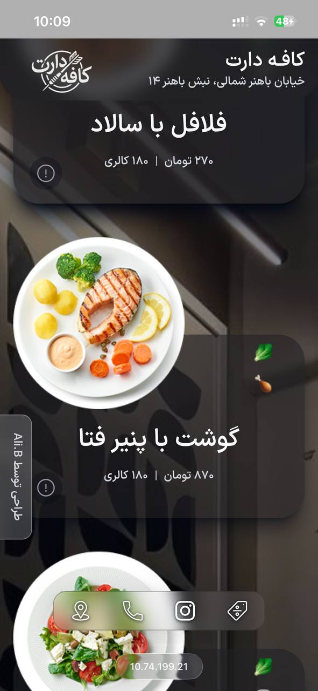
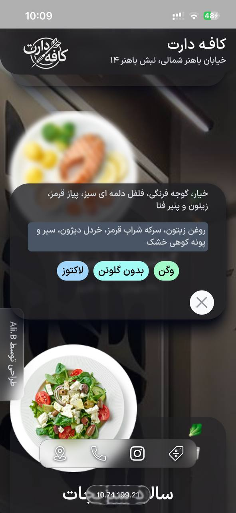
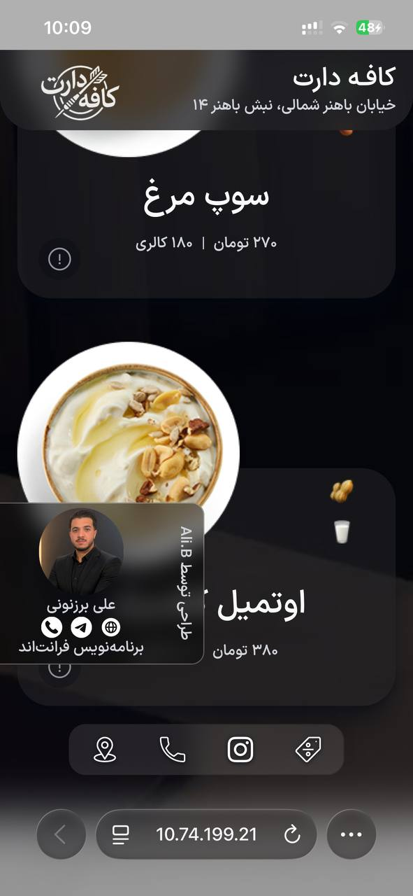

# 🍽️ Digital Menu App

A modern and responsive digital restaurant menu built with React and Tailwind CSS.

This project provides an elegant and user-friendly experience for customers to browse menu items quickly and efficiently across all devices.

## ✨ Features

- ⚛️ Built with React
- 🎨 Styled with Tailwind CSS
- 📱 Fully Responsive Design
- 🚀 Smooth Animations & Transitions
- 🍔 Modern Food Menu UI
- 🔍 Easy Navigation & User-Friendly Experience
- ⚡ Fast Performance
- 🌐 Cross-Browser Compatibility

## 🛠️ Technologies Used

- React
- Tailwind CSS
- JavaScript (ES6+)
- HTML5
- CSS3

## 📸 Preview





## 🚀 Installation

UI by : https://www.figma.com/design/tjWFR8DKBwiluzwUoxcfXT/Food-terminal---POS-for-tablet--%F0%9F%A6%84-freebies--Community-?m=auto&t=13PQJIWI3EF8MbXa-6

# README (فارسی)

# 🍽️ اپلیکیشن منوی دیجیتال

یک منوی دیجیتال مدرن و ریسپانسیو برای رستوران‌ها و کسب‌وکارهای غذایی که با React و Tailwind CSS توسعه داده شده است.

این پروژه با تمرکز بر تجربه کاربری روان، طراحی زیبا و دسترسی آسان به اطلاعات منو در تمامی دستگاه‌ها طراحی شده است.

## ✨ امکانات

- ⚛️ توسعه یافته با React
- 🎨 طراحی شده با Tailwind CSS
- 📱 کاملاً ریسپانسیو برای موبایل، تبلت و دسکتاپ
- 🚀 دارای انیمیشن‌ها و ترنزیشن‌های روان
- 🍔 رابط کاربری مدرن و جذاب
- 🔍 دسترسی سریع و آسان به آیتم‌های منو
- ⚡ عملکرد سریع و بهینه
- 🌐 سازگار با مرورگرهای مختلف

## 🛠️ تکنولوژی‌های استفاده شده

- React
- Tailwind CSS
- JavaScript (ES6+)
- HTML5
- CSS3

## 📸 پیش‌نمایش


.

## 🚀 راه‌اندازی پروژه

ابتدا مخزن را دریافت کنید:

```bash
git clone https://github.com/your-username/digital-menu-app.git
